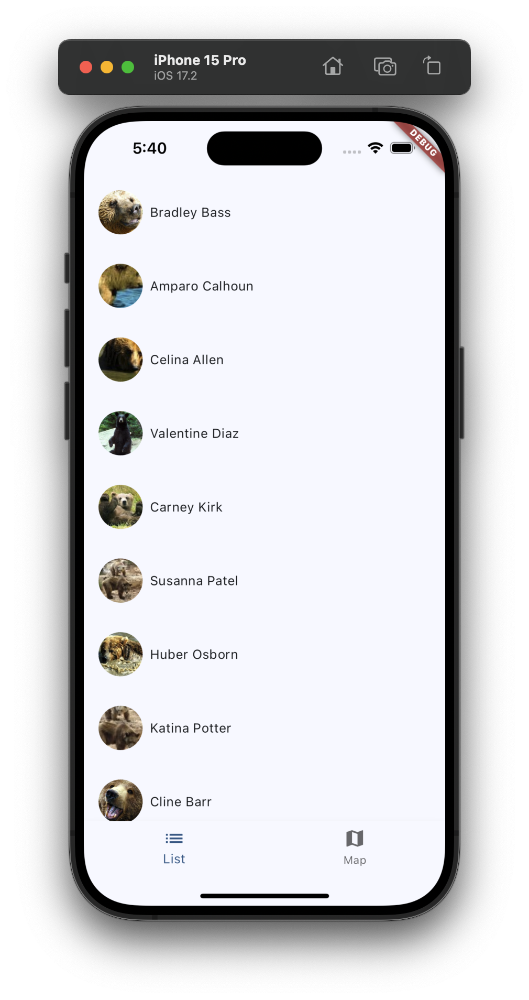
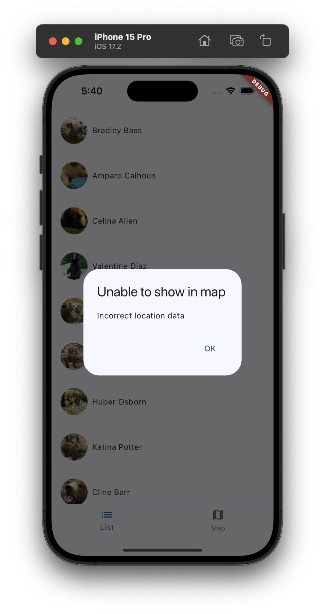
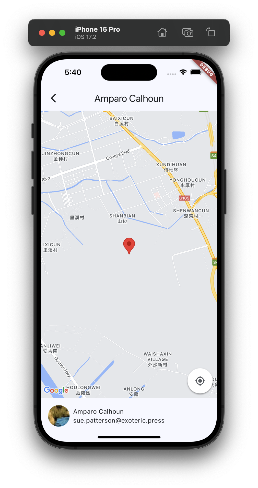
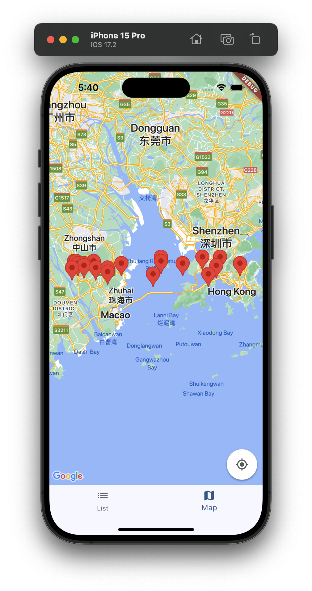
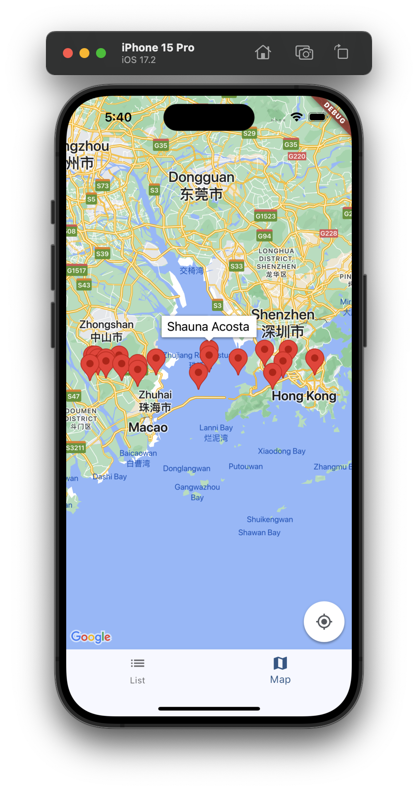
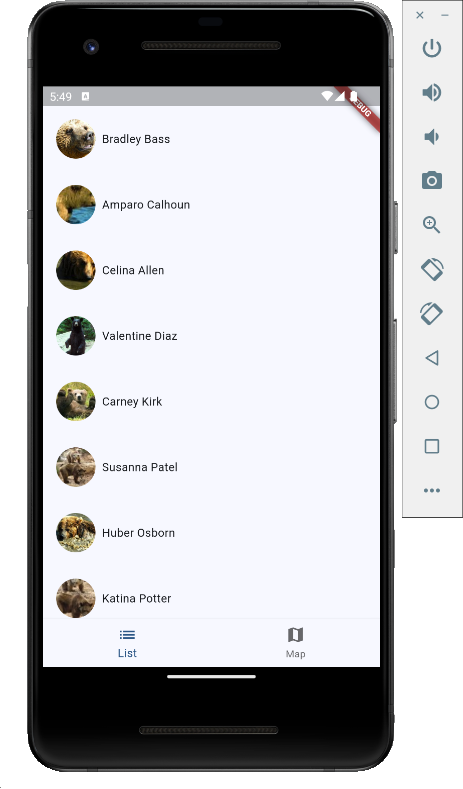
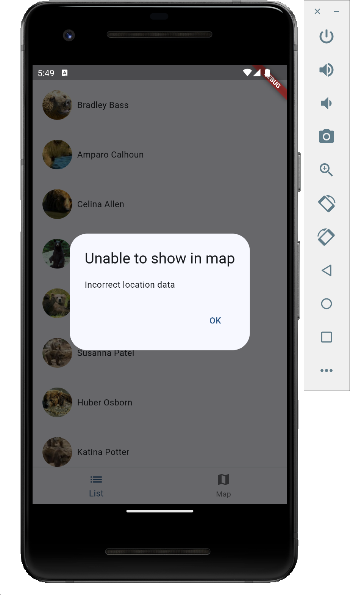
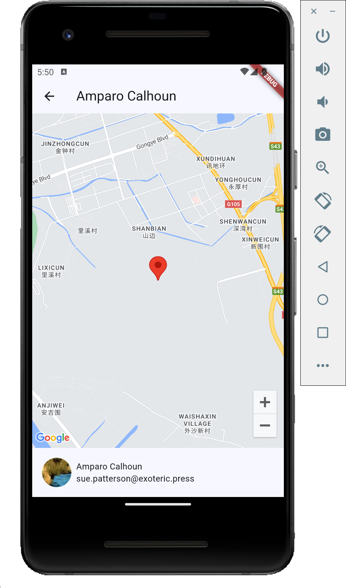
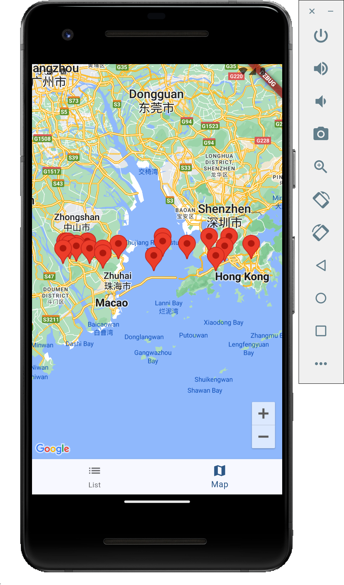

# Technical Test Q2

## Reminder
⚠️⚠️⚠️⚠️⚠️⚠️⚠️⚠️⚠️⚠️⚠️
Due to the limitation of Google Map API Key, for android build, it might not be able to show the Google Map as I enabled the API key restriction with SHA-1 fingerprint.
Please download APK on Relase section for Android
⚠️⚠️⚠️⚠️⚠️⚠️⚠️⚠️⚠️⚠️⚠️

## Environment

```
[✓] Flutter (Channel master, 3.21.0-14.0.pre.2, on macOS 14.3.1 23D60 darwin-arm64, locale en-HK)
```

## iOS Preview


## Android Preview
